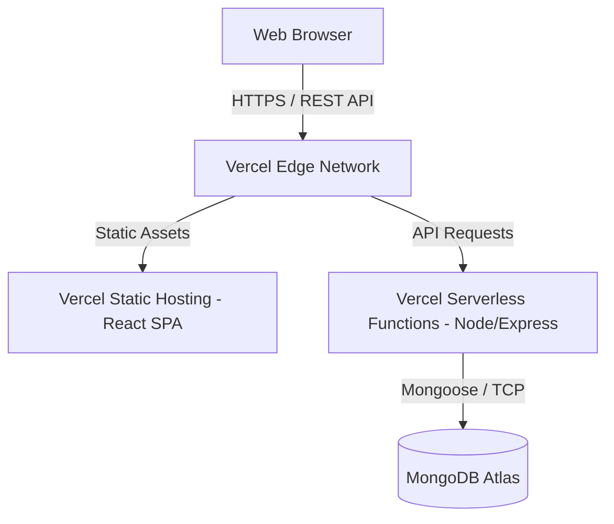

# System Architecture

## Overview
The Mini ERP + CRM System utilizes a decoupled client-server architecture built entirely around JavaScript/TypeScript, commonly known as the MERN stack (MongoDB, Express, React, Node.js). 

## High-Level Diagram

## Application Layers

### 1. Presentation Layer (Frontend)
- **Framework**: React 18 with Vite for rapid module bundling.
- **State Management**: Zustand for global state (Authentication) and React Query (TanStack Query) for server state caching, pagination, and invalidation.
- **Routing**: React Router DOM with protected route wrappers (`RoleGuard`) implementing RBAC checks at the UI level.
- **Styling**: Tailwind CSS coupled with Shadcn UI for consistent, accessible design tokens.

### 2. Business Logic Layer (Backend)
- **Framework**: Express.js wrapped in serverless handlers for Vercel deployment.
- **Authentication**: JWT-based stateless authentication. The server issues an `httpOnly` cookie upon login, shielding the token from XSS attacks.
- **Middleware Chain**:
  - `helmet`: Security headers
  - `cors`: Cross-Origin Resource Sharing rules
  - `rate-limiter`: Brute-force protection on Auth routes
  - `authMiddleware`: JWT extraction and validation
  - `roleMiddleware`: Endpoint-level RBAC enforcement

### 3. Data Layer (Database)
- **System**: MongoDB hosted on MongoDB Atlas (DBaaS).
- **ODM**: Mongoose, providing strict schema validations, pre/post save hooks, and population mechanisms for relational-like queries (e.g., joining User IDs to Customer records).

## Deployment Architecture
- **Frontend Infrastructure**: Deployed as a static application on Vercel's Edge Network, ensuring fast global CDN delivery.
- **Backend Infrastructure**: Deployed as Vercel Serverless Functions. Express routes are redirected through a single `api/index.js` entry point via `vercel.json` rewrites. This approach ensures low latency and high scalability without the overhead of maintaining an always-on VM.
