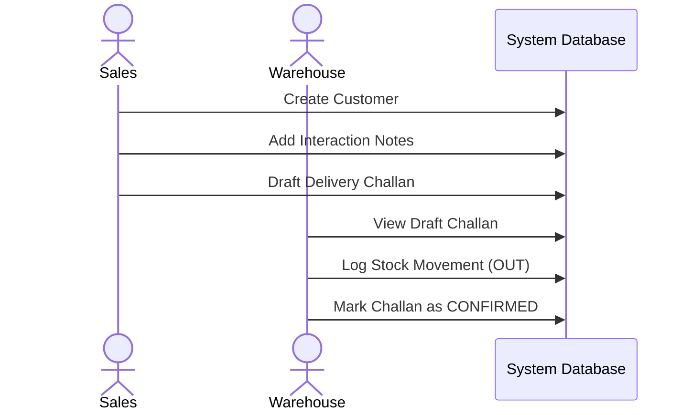

# Business Workflows

The Mini ERP + CRM System orchestrates daily operational workflows. Different roles participate in different stages of the lifecycle.

## Role Definitions
- **ADMIN**: Superuser. Has full access to all CRUD operations across all modules.
- **SALES**: Manages the CRM aspect. Creates customers, logs interactions, and drafts outbound delivery challans.
- **WAREHOUSE**: Manages physical inventory. Adds new product SKUs, logs stock IN/OUT movements, and fulfills delivery challans.
- **ACCOUNTS**: Read-only access to customer data and challans for invoicing and billing purposes.

## Workflow 1: Customer Onboarding & CRM
1. **SALES** identifies a new lead and creates a `Customer` profile (`POST /customers`).
2. After a call or meeting, **SALES** adds a timestamped Note to the customer profile documenting the interaction (`POST /customers/:id/notes`).

## Workflow 2: Inventory Replenishment
1. A vendor delivery arrives at the warehouse.
2. If the products are new, **WAREHOUSE** creates them in the product catalog (`POST /products`).
3. **WAREHOUSE** registers a Stock Movement with type `IN` and a reference to the Purchase Order (`POST /stock-movements`).
4. The system automatically increments the `currentStock` of those products.

## Workflow 3: Order Fulfillment (Delivery Challan)
1. **SALES** closes a deal with a customer and drafts a Delivery Challan specifying the products and quantities (`POST /challans` -> Status: `DRAFT`).
2. **WAREHOUSE** views the drafted challans in the dashboard.
3. **WAREHOUSE** picks and packs the items. To formalize the dispatch, **WAREHOUSE** updates the challan status to `CONFIRMED` (`PUT /challans/:id`).
4. Concurrently, **WAREHOUSE** must log a Stock Movement with type `OUT` referencing the Challan Number to decrement the inventory.
5. **ACCOUNTS** views the confirmed challan and generates an external invoice (outside this system's current scope).

