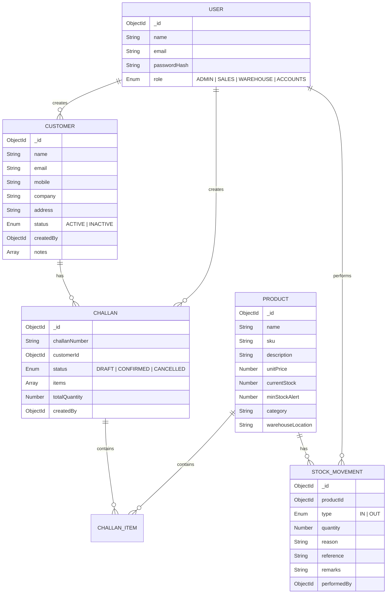

# Database Schema & ER Diagram

## Overview
The database uses MongoDB, a NoSQL document database. Mongoose is used as the Object Data Modeling (ODM) library to enforce strict schemas. 

## Entity Relationship (ER) Diagram

## Core Collections

### 1. Users
Stores employee records, password hashes, and their RBAC roles.
- **Key Fields**: `email` (unique), `role` (enum).

### 2. Customers
Stores CRM data.
- **Notes Sub-document**: Allows sales reps to append timestamped notes/activity logs to a customer profile.

### 3. Products
Central inventory catalog.
- **Key Fields**: `sku` (unique), `currentStock` (computed and modified via Stock Movements, not manually).

### 4. Stock Movements
An append-only ledger for inventory changes.
- **Behavior**: Inserting a record here triggers a pre/post hook (or controller logic) to increment/decrement `currentStock` in the `Products` collection.

### 5. Challans
Delivery challans representing goods sent to a customer.
- **Items Sub-document**: Contains snapshots of product data (name, sku, unit price) at the time the challan was created to ensure historical data integrity if a product is later renamed or priced differently.
